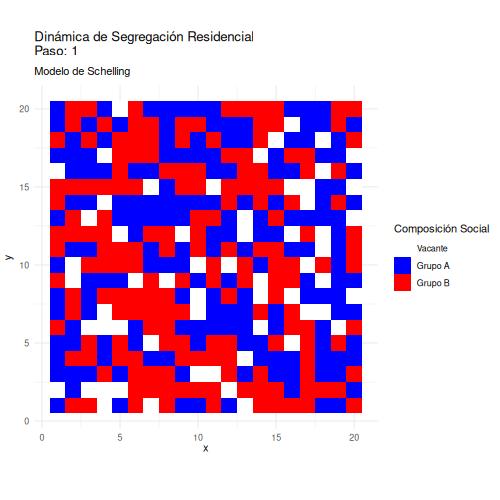

# Introducción a los Modelos Basados en Agentes
> Workshop Chisocnet 2025

Este repositorio contiene los materiales para el Workshop de Introducción a los Modelos Basados en Agentes (ABM), parte del programa de Chisocnet 2025.




### 🎯 Materiales del Workshop

- [📊 Presentación](https://rcantillan.github.io/pres/slides_ABM_workshop.pdf) 
- [💻 Script de práctica I](https://rcantillan.github.io/code/ABM_workshop/03_schelling)
- [💻 Script de práctica II](https://rcantillan.github.io/code/ABM_workshop/04_contagion) (Profundización autónoma)

### 📚 Recursos Bibliográficos

#### Lecturas Fundamentales

- Acerbi, A., Mesoudi, A., & Smolla, M. (2023). [Individual-Based Models of Cultural Evolution: A Step-by-Step Guide Using R](bibliography/acerbi_et_al_2022.pdf). *Routledge*
- Macy, M. W., & Willer, R. (2002). [From Factors to Actors: Computational Sociology and Agent-Based Modeling](bibliography/annurev.soc.28.110601.141117.pdf). *Annual Review of Sociology* 28(1), 143-166. https://doi.org/10.1146/annurev.soc.28.110601.141117
- Schelling, T. C. (1971). [Dynamic models of segregation](bibliography/schelling1971.pdf). *Journal of Mathematical Sociology, 1*(2), 143-186.

#### Lecturas Complementarias

- Gilbert & Troitzsch (2005). [Simulation for the social scientist](https://cress.soc.surrey.ac.uk/s4ss/S4SS-sample-chapter.pdf). Open University Press. 
- Manzo, G. (2022). [Agent-based models and causal inference](bibliography/manzo2022.pdf). John Wiley & Sons, Inc.
- Smaldino, P. E. (2023). [Modeling social behavior: Mathematical and agent-based models of social dynamics and cultural evolution](bibliography/smaldino2023.pdf). Princeton University Press.

### 🔧 Preparación del Entorno

#### Requisitos Previos

- R (versión ≥ 4.0.0)
- RStudio 

#### Instalación de Paquetes

```r
# Instalación de paquetes necesarios
install.packages(c(
"tidyverse"   # Para manejo de datos y gráficos base
"gganimate"   # Para animaciones
"gifski"      # Para generar GIFs
"ragg"        # Para mejor renderizado
"gridExtra"   # Para combinar gráficos
"viridis"     # Para paletas de colores
))
```

#### Configuración

1. Clonar el repositorio:
```bash
git clone https://github.com/rcantillan/ABM_workshop.git
```

2. Iniciar proyecto:
   - Abrir `ABM_workshop.Rproj` en RStudio

### 📁 Estructura del Proyecto

```
ABM_workshop/
├── bibliography/         # Referencias bibliográficas
├── pres/                 # Presentación
├── code/                 # Códigos y scripts
├── img/                  # Imágenes y recursos visuales
├── ABM_workshop.Rproj    # Archivo del proyecto R
├── LICENSE               # Archivo de licencia
└── README.md             # Este archivo
```

### ℹ️ Información del Workshop

- **Evento**: Chisocnet 2025
- **Fecha**: 25 de Octubre, 2025
- **Lugar**: Pontificia Universidad Católica de Chile. Instituto de Sociología. 
- **Modalidad**: Presencial
- **Duración**: 1 hr. y 40 m. (incluye pausas)

### 💬 Soporte

- 🐛 Reporta problemas vía [Issues](../../issues)
- 📧 Contacta al instructor directamente: ricantillan@uc.cl

### 📄 Licencia

Este proyecto está bajo la Licencia MIT - ver [LICENSE.md](LICENSE.md) para detalles.


