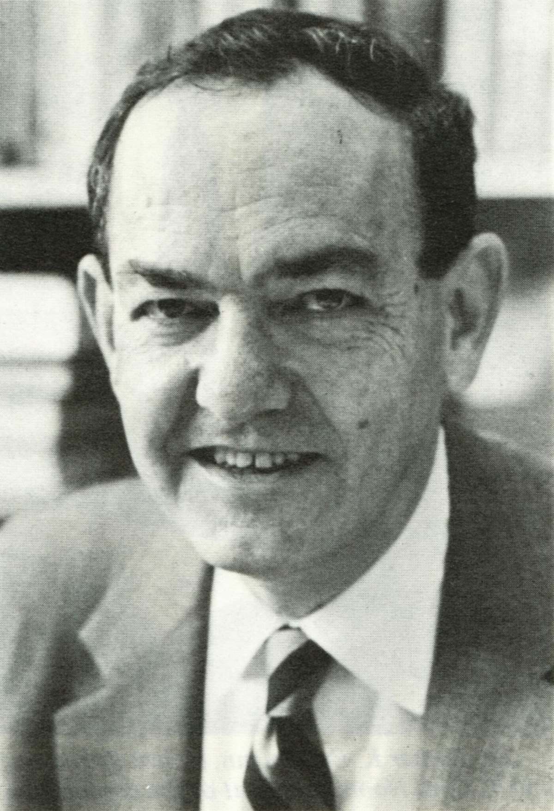
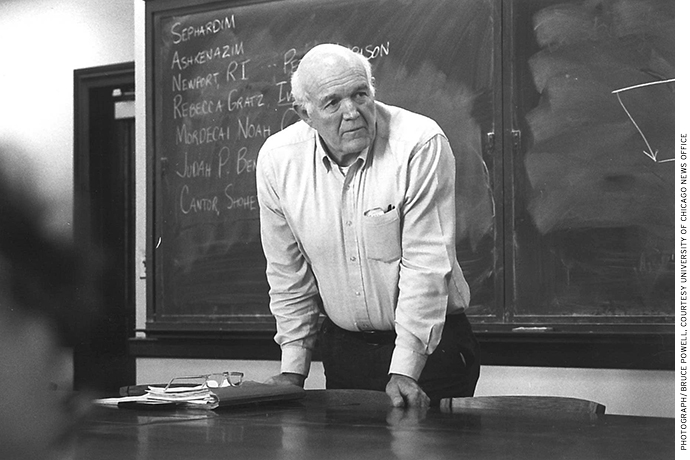
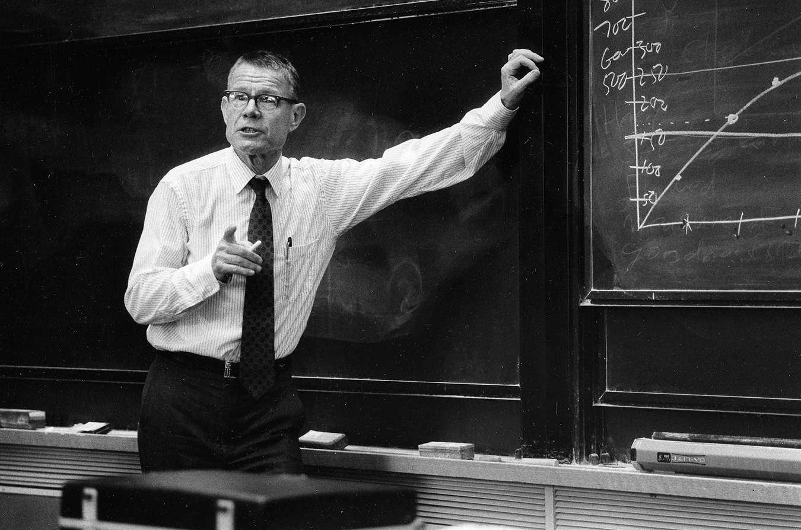
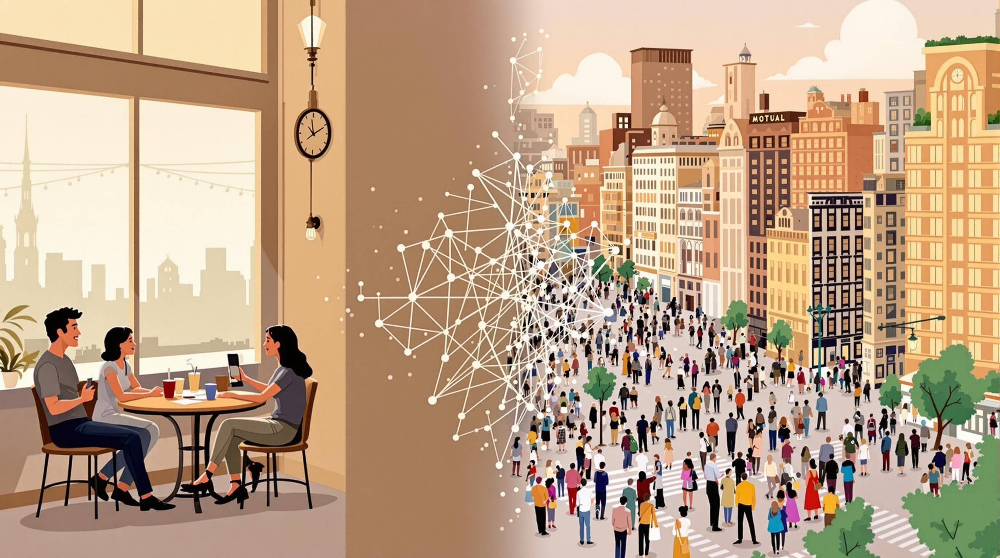

```{r setup, include=FALSE}
options(htmltools.dir.version = FALSE)
```

```{r xaringan-themer, include=FALSE}
library(xaringanthemer)
library(xaringanExtra)
use_panelset()


style_duo_accent(
  footnote_color = "#2c8475",
  footnote_position_bottom = "20px",
  footnote_font_size = "0.5em",
  primary_color = "#28282B",
  #primary_color = "#7393B3",
  secondary_color = "#2c8475",
  black_color = "#4242424",
  white_color = "#FFF",
  base_font_size = "25px",
  # text_font_family = "Jost",
  # text_font_url = "https://indestructibletype.com/fonts/Jost.css",
  header_font_google = google_font("Libre Franklin", "200", "400"),
  header_font_weight = "200",
    header_background_color = "#2c8475",
    header_background_text_color = "#2c8475",

  inverse_header_color = "#eaeaea",
  title_slide_text_color = "#FFFFFF",
  text_slide_number_color = "#9a9a9a",
  text_bold_color = "#6A5ACD",
  code_inline_color = "#B56B6F",
  code_highlight_color = "transparent",
  link_color = "#2c8475",
  table_row_even_background_color = lighten_color("#345865", 0.9),
  extra_fonts = list(
    "https://indestructibletype.com/fonts/Jost.css",
    google_font("Amatic SC", "400")
  ),
  colors = c(
    green = "#31b09e",
    "green-dark" = "#2c8475",
    highlight = "#87f9bb",
    purple = "#887ba3",
    pink = "#B56B6F",
    orange = "#f79334",
    red = "#dc322f",
    `blue-dark` = "#002b36",
    `text-dark` = "#202020",
    `text-darkish` = "#424242",
    `text-mild` = "#606060",
    `text-light` = "#9a9a9a",
    `text-lightest` = "#eaeaea"
  ),
  extra_css = list(
    ".remark-slide-content h3" = list(
      "margin-bottom" = 0, 
      "margin-top" = 0
    ),
    ".smallish, .smallish .remark-code-line" = list(`font-size` = "0.7em")
  )
)
xaringanExtra::use_xaringan_extra(c("tile_view", "animate_css", "tachyons", "share_again"))
xaringanExtra::use_extra_styles()

```

```{r metadata, echo=FALSE}
library(metathis)
meta() %>% 
  meta_description("Introducción a los modelos basados en agentes, Pontificia Universidad Católica de Chile, Enero 10, 2025") %>% 
  meta_social(
    title = "Introducción a los modelos basados en agentes",
    url = "",
    image = "",
    twitter_card_type = "summary_large_image",
    twitter_creator = "ricantillan"
  )
```


```{r components, include=FALSE}
slides_from_images <- function(
  path,
  regexp = NULL,
  class = "hide-count",
  background_size = "contain",
  background_position = "top left"
) {
  if (isTRUE(getOption("slide_image_placeholder", FALSE))) {
    return(glue::glue("Slides to be generated from [{path}]({path})"))
  }
  if (fs::is_dir(path)) {
    imgs <- fs::dir_ls(path, regexp = regexp, type = "file", recurse = FALSE)
  } else if (all(fs::is_file(path) && fs::file_exists(path))) {
    imgs <- path
  } else {
    stop("path must be a directory or a vector of images")
  }
  imgs <- fs::path_rel(imgs, ".")
  breaks <- rep("\n---\n", length(imgs))
  breaks[length(breaks)] <- ""

  txt <- glue::glue("
  class: {class}
  background-image: url('{imgs}')
  background-size: {background_size}
  background-position: {background_position}
  {breaks}
  ")

  paste(txt, sep = "", collapse = "")
}
options("slide_image_placeholder" = FALSE)
```

class: left title-slide
background-image: url('marcella-marcella-BXR9wvl29J8-unsplash.jpg')
background-size: cover
background-position: left


[ricantillan]: https://twitter.com/ricantillan
[github]: https://rcantillan.github.io


.side-text[
[&commat;ricantillan][ricantillan] | [rcantillan.github.io][github]
]

.title-where[
### **Introducción a los <br> Modelos Basados en Agentes**
Pontificia Universidad Católica de Chile | CHISOCNET<br>
Enero 10, 2025
]

```{css echo=FALSE}
.title-slide h1 {
  font-size: 80px;
  font-family: Jost, sans;
  color: #6A5ACD;  /* Cambio del color del texto a morado */
   position: absolute;
  top: 150px; /* Ajusta este valor para mover verticalmente */
  left: 50px; /* Ajusta este valor para mover horizontalmente */
}

.side-text {
  color: #6A5ACD;  /* Cambio del color del texto lateral a morado */
  transform: rotate(90deg);
  position: absolute;
  font-size: 22px;
  top: 150px;
  right: -130px;
}

.side-text a {
  color: #6A5ACD;  /* Cambio del color de los enlaces a morado */
}

.title-where {
  font-family: Jost, sans;
  font-size: 25px;
  position: absolute;
  bottom: 10px;
  color: #6A5ACD;  /* Cambio del color del texto de ubicación a morado */
}

/******************
 * 
 * Coloured content boxes
 *
 ****************/


.content-box { 
    box-sizing: content-box;
    	background-color: #e2e2e2;
  /* Total width: 160px + (2 * 20px) + (2 * 8px) = 216px
     Total height: 80px + (2 * 20px) + (2 * 8px) = 136px
     Content box width: 160px
     Content box height: 80px */
}

.content-box-primary,
.content-box-secondary,
.content-box-blue,
.content-box-gray,
.content-box-grey,
.content-box-army,
.content-box-green,
.content-box-purple,
.content-box-red,
.content-box-yellow {
    /*border-radius: 15px; */
    margin: 0 0 25px;
    overflow: hidden;
    padding: 20px;
    width: 100%;
}


.content-box-primary {
	background-color: var(--primary);

}


.content-box-secondary {
	background-color: var(--secondary);

}

.content-box-blue {
    background-color: #F0F8FF;

}

.content-box-gray {
    background-color: #e2e2e2;
}

.content-box-grey {
	background-color: #F5F5F5;
}

.content-box-army {
	background-color: #737a36;
}

.content-box-green {
	background-color: #d9edc2;
}

.content-box-purple {
	background-color: #e2e2f9;
}

.content-box-red {
	background-color: #f9dbdb;
}

.content-box-yellow {
	background-color: #fef5c4;
}


.full-width {
    display: flex;
    width: 100%;
    flex: 1 1 auto;
}

```


```{r logo, echo=FALSE}
library(xaringanExtra)
use_logo(
  image_url = "logo-uc-05.svg",
  exclude_class = c("title-slide","hide_logo","inverse"),
  width = "150px",
  height = "150px")
```


---

class: left middle

.full-width[.content-box-purple[
.bolder[]
"La verdad se encuentra directamente frente a nosotros en la realidad que nos rodea. Sin embargo, no podemos usarla tal como es. Una descripción ininterrumpida de la realidad sería simultáneamente la cosa más verdadera y más inútil del mundo, y ciertamente no sería ciencia." **Jakob von Uexküll**
]]


---

class: left middle

### **La Necesidad de Modelos**

> "Si no hiciste crecer el fenómeno, no lo explicaste" - Joshua Epstein

- La realidad es demasiado compleja para estudiarla directamente
- Necesitamos simplificar para entender
- Los modelos son representaciones abstractas que capturan elementos esenciales
- "Debemos hacer violencia a la realidad" para entenderla científicamente


---

class: right middle

### **Predecesores y Fundadores**

---
class: left middle

### **Herbert Simon y los Sistemas Complejos**

.w-60.fl[

- Herbert Simon estableció fundamentos cruciales para la sociología computacional basada en agentes al argumentar que no existe isomorfismo entre la complejidad macro y micro en sistemas sociales. 

- En muchos casos, como señala Squazzoni (2012), la complejidad que muestran los sistemas sociales a nivel macro no es más que el resultado de la interacción entre procesos micro simples. 

- Simon también enfatizó la importancia de estudiar "sistemas pobremente entendidos" mediante simulación computacional.
]

.w-40.fr[
### 

```{r out.width = '60%', echo = FALSE, fig.align = 'center'}
 
```

]

---

class: left middle

### **James S. Coleman y la Simulación Social**

.w-40.fl[

```{r out.width = '100%', echo = FALSE, fig.align = 'center'}
 
```


]
.w-60.fr[

- Desde la Universidad Johns Hopkins, Coleman publicó contribuciones fundamentales para promover el uso de modelos de simulación en sociología.

- Su perspectiva se centró en compensar las limitaciones de los modelos analíticos deductivos e incluir datos tanto cuantitativos como cualitativos. 

- Coleman (1964) argumentó que la simulación podría ser vista como *"un puente entre los individuos, sobre quienes se realizan la mayoría de las observaciones del sociólogo, y los sistemas sociales, que son sus objetos de interés"* (p. 1055).
]

---
class: left middle

### **Raymond Boudon y el Enfoque Generativo**

.w-60.fl[
- Boudon realizó un trabajo pionero con su modelo de simulación para examinar las tasas de casos abandonados por fiscales estatales en Francia entre 1879 y 1931. 

- Su contribución fue fundamental al demostrar que los modelos de simulación podrían *"verificar un conjunto de hipótesis sobre los mecanismos responsables de las variaciones empíricamente observadas de estas tasas"* (Davidovitch & Boudon 1964, p. 217). 

- Boudon enfatizó que la simulación podía ayudar a formalizar modelos capaces de generar patrones comparables con observaciones empíricas.
]

.w-40.fl[

```{r out.width = '90%', echo = FALSE, fig.align = 'center'}
knitr::include_graphics("raymond-boudon.jpeg") 
```

]

---
class: left middle

### **Mark Granovetter y el Comportamiento Colectivo**

.w-40.fl[

```{r out.width = '80%', echo = FALSE, fig.align = 'center'}
knitr::include_graphics("mark_granovetter.jpg") 
```

]

.w-60.fr[
- Granovetter contribuyó significativamente al entendimiento del comportamiento colectivo en sistemas sociales durante los años 70 y 80. 

- Al modelar disturbios en una población sujeta a influencia social, Granovetter demostró que "es arriesgado inferir disposiciones individuales de resultados agregados" (1978, p. 1425). 

- Sus modelos de umbral ayudaron a entender cómo paradojas aparentes del comportamiento colectivo podían explicarse mediante procesos de agregación.
]

---
class: left middle


### **Thomas Schelling y la Segregación**

.w-60.fl[
- El trabajo de Schelling, particularmente su modelo de segregación de 1971, demostró cómo patrones macroscópicos de segregación podían emerger de preferencias individuales moderadas. 

- Schelling enfatizó la importancia del "comportamiento contingente" *- comportamiento individual que depende de lo que otros hacen -* para entender cómo las acciones individuales causan patrones sociales imprevistos e inesperados.
]

.w-40.fr[
```{r out.width = '100%', echo = FALSE, fig.align = 'center'}
 
```
]
---
class: right middle

### **Las Ideas Principales de la Sociología Computacional Basada en Agentes**

---

class: left middle

#### **Funcionalismo vs. ABM**

| Aspecto | Funcionalismo | Modelos Basados en Agentes |
|---------|---------------|---------------------------|
| **Enfoque** | Top-down: estructuras sociales determinan comportamiento | Bottom-up: patrones emergen de interacciones |
| **Explicación** | Necesidades funcionales del sistema | Mecanismos generativos e interacciones |
| **Individuos** | Portadores de roles y normas | Agentes autónomos con capacidad decisoria |
| **Dinámica** | Énfasis en estabilidad y equilibrio | Modelado de cambios dinámicos y no-lineales |
| **Metodología** | Descripciones cualitativas y variables agregadas | Modelado formal de interacciones y emergencia |

---
class: left middle

### **La Primacía de los Modelos**

- Un modelo es una representación simplificada de un objetivo empírico. En la sociología computacional basada en agentes, los modelos son fundamentales porque:


.full-width[.content-box-purple[
.bolder[]
"Los modelos son ejercicios preliminares de teoría y mantienen un vínculo estrecho con la realidad empírica. Como lo demuestra la dificultad de comparar y probar casos empíricos narrativos y cuentas teóricas no formalizadas, el valor agregado del modelado es que puede garantizar la acumulación de hallazgos científicos a nivel intersubjetivo" (Squazzoni 2012).
]]

.footnote[
[1] Squazzoni, F. (2012). Agent‐Based Computational Sociology (1.ª ed.). Wiley. https://doi.org/10.1002/9781119954200
]

---
class: left middle

### **El Enfoque Generativo**

- El enfoque generativo es crucial para entender sistemas sociales complejos donde la deducción analítica top-down es una guía pobre. Como explica Epstein (2006):

.full-width[.content-box-purple[
.bolder[]
- "Dado algún explanandum macroscópico - una regularidad a ser explicada - el experimento canónico basado en agentes consiste en: Situar una población inicial de agentes autónomos heterogéneos en un ambiente espacial relevante; permitirles interactuar de acuerdo a reglas locales simples, y así generar la regularidad macroscópica desde abajo hacia arriba."
]]

.footnote[
[1] Epstein, J. M. (2006). Generative social science: Studies in agent-based computational modeling. Princeton university press.
]

---
class: left middle

### **El Vínculo Micro-Macro**

.w-60.fl[
La sociología computacional basada en agentes permite estudiar:
- Los mecanismos micro y procesos locales que son responsables de patrones macro
- El impacto de los patrones macro en el comportamiento micro a lo largo del tiempo
- La naturaleza auto-organizada de los patrones sociales
]

.w-40.fr[
```{r out.width = '100%', echo = FALSE, fig.align = 'center'}
 
```
]

---

class: right middle

### **Fundamentos teóricos**


---

class: left middle

### **Fenómenos Emergentes**

.w-60.fl[
1. Los fenómenos emergentes son indeducibles.

2. Los fenómenos emergentes son inexplicables.

3. Los fenómenos emergentes son impredecibles.

4. Los fenómenos emergentes son irreducibles.

5. Los fenómenos emergentes no son ninguno de los anteriores.
]

.w-40.fr[
```{r out.width = '60%', echo = FALSE, fig.align = 'center'}
knitr::include_graphics("9781400842872.png") 
```
]

.footnote[
[1] Holland, J. H. (1998). Emergence: From chaos to order. Reading, MA: Addison-Wesley.

[2] Epstein, J. M. (2006). Generative social science: Studies in agent-based computational modeling. Princeton university press.
]

---

class: left middle

### **Fenómenos Emergentes II**

- Patrones colectivos que emergen de reglas simples
- No son reducibles a comportamientos individuales

- Ejemplos:
  - Bandadas de pájaros
  - Segregación residencial
  - Normas sociales
  
---

class: left middle

### **¿Por qué son importantes los fenómenos emergentes?**

- La mayoría de fenómenos sociales son emergentes
- Las intenciones individuales pueden producir resultados inesperados
- Los modelos nos ayudan a:
  - Identificar mecanismos causales
  - Entender cómo surgen patrones colectivos
  - Predecir posibles resultados

---
class: left middle

### **Modelado en Ciencias Inexactas**
#### **Características especiales**

- No hay correspondencia directa entre mediciones y teoría
- Conceptos difíciles de medir:
  - Normas
  - Identidad
  - Cooperación
  - Confianza
- Múltiples niveles de organización interactuando

---

class: left middle

### **Modelado en Ciencias Inexactas II**

1. **Precisión**:
   - Fuerzan articulación exacta de supuestos
   - Evitan ambigüedad del lenguaje
   - Facilitan comunicación científica

2. **Tractabilidad**:
   - Permiten explorar consecuencias lógicas
   - Prueban diferentes escenarios
   - Generan predicciones verificables

3. **Insight**:
   - Desarrollan intuición sobre sistemas complejos
   - Revelan conexiones no obvias
   - Son "prótesis para la imaginación"


---

class: right middle

## **¿Qué son los ABMs?**

---

class: left middle

### **Tipos de Modelos**

#### **Basados en Ecuaciones**
- Matemáticamente tratables
- Buenos para dinámicas generales
- Ejemplo: Modelo SIR epidemiológico

#### **Basados en Agentes**
- Capturan heterogeneidad individual
- Permiten interacciones locales
- Ejemplo: Modelo de segregación de Schelling

---

class: left middle

### **¿Qué es un Modelo Basado en Agentes (ABM)?**

- **Definición**: Un ABM es un programa computacional que simula:
  - **Agentes**: Entidades individuales con estados y comportamientos.
  - **Reglas**: Interacciones entre agentes.
  - **Entorno**: El espacio donde los agentes interactúan.

- **Diferencias clave**:
  - **ABMs**: Representan individuos, sus comportamientos e interacciones.
  - **Modelos basados en ecuaciones**: Representan agregados y sus dinámicas.

---

class: left middle

## **Características Distintivas**

Los Modelos Basados en Agentes permiten:

1. Lograr correspondencia ontológica con el mundo real mediante agentes que imitan características cognitivas y sociales de actores reales
2. Incluir heterogeneidad de agentes en términos de reglas de comportamiento, información y posición
3. Estudiar interacción no lineal y sus consecuencias macro emergentes
4. Representar explícitamente el ambiente y sus restricciones
5. Visualizar dinámicas complejas de interacción


---

class: left middle

### **Descomposición: La Base del Modelado**

#### Preguntas Fundamentales

1. ¿Cuáles son las partes relevantes del sistema?
2. ¿Qué propiedades tienen estas partes?
3. ¿Cómo se relacionan entre sí?
4. ¿Cómo cambian estas relaciones en el tiempo?


---

class: left middle

#### **Clasificación del Uso de ABMs en Investigación Social**

| Tipo | Objetivo | Características | Ejemplo |
|------|-----------|----------------|----------|
| Sociedades Artificiales | Explorar comportamiento social in-silico | • Integración multiaspecto<br>• Experimentación virtual | Sugarscape: demografía, economía y sociedad |
| Abstractos | Principios generales | • Alta generalización<br>• Mecanismos básicos | Schelling: segregación residencial |
| Rango Medio | Vincular teoría-evidencia | • Balance abstracción-especificidad<br>• Validación parcial | Difusión de innovaciones |
| Basados en Casos | Replicar casos específicos | • Alta especificidad<br>• Validación directa | Anasazi: reconstrucción histórica |
| Aplicados | Resolver problemas reales | • Orientado a decisiones<br>• Validación práctica | Irrigación Bali: gestión de recursos |


---


class: left middle

### **Ejemplos prácticos**

---

class: left middle


### **Flocking Birds and Boids**

.w-50.fl[
- Craig Reynolds (1980s): científico computacional buscando simular bandadas realistas para gráficos de película
- Problema: impracticabilidad de codificar manualmente cada trayectoria individual
- Observación clave: las bandadas se forman independientemente de su tamaño
- Insight derivado: el comportamiento debe emerger de reglas simples basadas en información local
- Solución propuesta: desarrollar un modelo donde reglas individuales simples producen el comportamiento colectivo
]

.w-40.fr[
```{r out.width = '100%', echo = FALSE, fig.align = 'center'}
 
```

]

---

class: left middle

#### **Flocking Birds and Boid: Descomposición**

| Aspecto | Descripción |
|----------|-------------|
| **Agentes** | Boids: partículas que se mueven en espacio 2D/3D con campo de visión limitado y velocidad constante |
| **Regla 1: Separación** | Evitar colisiones girando lejos de boids cercanos |
| **Regla 2: Alineación** | Ajustar dirección al promedio de boids vecinos |
| **Regla 3: Cohesión** | Moverse hacia la posición promedio de los vecinos |
| **Emergencia** | Formación de bandadas coherentes sin control central (auto-organización) |


---

class: left middle

.w-50.fl[

```{r out.width = '80%', echo = FALSE, fig.align = 'center'}
knitr::include_graphics("boids.gif") 
```
]

.w-50.fr[

### **Resultados y Propiedades Emergentes**

- Formación de bandadas coherentes
- Movimiento coordinado del grupo
- Evitación de obstáculos naturalmente emergente
- Comportamiento realista similar a bandadas reales de aves

]

---

class: middle left

```{r, echo = FALSE}
knitr::include_url("https://platform.destine.eu/", height = "500px")
```

[web](https://platform.destine.eu/)

---

class: left middle 

### **El Modelo de Segregación de Schelling**
Thomas Schelling demostró algo sorprendente sobre la segregación racial:

- Configuración: Personas de dos grupos viven en un vecindario
- Regla simple: Cada persona quiere que al menos 30% de sus vecinos sean de su mismo grupo
- Resultado sorprendente: ¡Se produce segregación extrema!

Incluso cuando las personas están contentas siendo minoría (30% es menor que 50%), el proceso dinámico lleva a una segregación mucho mayor de lo que cualquiera deseaba. Este ejemplo muestra cómo las intenciones individuales pueden producir resultados colectivos inesperados.

---


class: middle left

```{r, echo = FALSE}
knitr::include_url("https://ncase.me/polygons/", height = "500px")
```

[web](https://ncase.me/polygons/)


---

class: left middle 


### **El Modelo de Diferenciación Cultural de Axelrod (1997)**

Este modelo fundamental demuestra cómo la diversidad cultural puede persistir a pesar de las presiones hacia la conformidad:

**Mecanismo Base**:

- Los agentes poseen múltiples rasgos culturales discretos
- La probabilidad de interacción aumenta con la similitud cultural
- En cada interacción, un agente adopta un rasgo del otro
- Las interacciones están limitadas localmente en una red

---
class: left middle 

**Dinámica del Proceso**:

- Inicialmente, los rasgos se distribuyen al azar
- Los agentes similares interactúan más frecuentemente
- Las interacciones aumentan la similitud
- Se forman regiones culturalmente homogéneas
- Las diferencias entre regiones se mantienen estables

**Hallazgo Clave**: A pesar de que las interacciones siempre aumentan la similitud, el sistema no converge a una monocultura. Las diferencias culturales persisten debido a que los grupos diferentes dejan de interactuar entre sí.


---

class: middle right
background-image: url('d-koi-GQJY4UPR21U-unsplash.jpg')
background-size: cover

# **Muchas Gracias**
### **Esta presentación fue realizada con el paquete  [Xaringan](https://slides.yihui.org/xaringan), diseñado para entorno  [R](https://www.r-project.org/)** 


